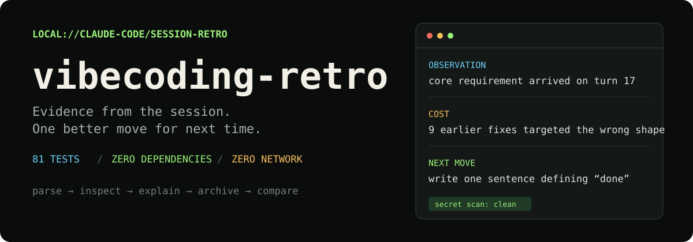

<p align="center">
  
</p>

<p align="center"><strong>English</strong> · <a href="./README.zh-CN.md">中文</a></p>

Three hours with an AI coding assistant and no idea where the time went. Say "retro" and get an answer backed by the session log, not by vibes.

```bash
git clone https://github.com/shenjiayi692-maker/vibecoding-retro && python3 vibecoding-retro/skills/vibecoding-retro/scripts/parse_session.py --list --limit 3
```

That reads your own Claude Code logs and prints what it can measure — no install, no dependencies, nothing leaves your machine. To use it properly, install it as a plugin (below).

**Vibecoding Retro** is a local Claude Code plugin for reviewing how an AI-assisted coding session actually went. Say “复盘” or run `/retro`; it parses the session log, finds concrete sources of waste, explains their cost in plain language, and ends each finding with one change to try next time.

No website, server, database, telemetry, or network request. The data stays in local text files that you can inspect, edit, version, or delete.

## What a retrospective looks like

```text
Observation
The core requirement first appeared on turn 17.

Cost
Nine earlier fixes targeted a mechanism that did not yet exist.

Next move
Before implementation, write one sentence describing what “done” must look like.
```

Reports deliberately avoid internal taxonomies, grades, and personality judgments. They talk about observable behavior: repeated file reads, oversized tool output, context carry, late constraints, unrelated work in one session, cache reuse, and compaction.

## Install

In Claude Code:

```text
/plugin marketplace add shenjiayi692-maker/vibecoding-retro
/plugin install vibecoding-retro@vibecoding-retro
```

Requirements: Claude Code and Python 3.9+. The plugin uses only the Python standard library.

To install only the skill—without slash commands or the SessionEnd index hook:

```bash
git clone https://github.com/shenjiayi692-maker/vibecoding-retro /tmp/vibecoding-retro
cp -r /tmp/vibecoding-retro/skills/vibecoding-retro ~/.claude/skills/
```

Verify log discovery:

```bash
python3 ~/.claude/skills/vibecoding-retro/scripts/parse_session.py --list --limit 3
```

## Use

| You say | The plugin does |
| --- | --- |
| `复盘` or `/retro` | Parse one session, produce evidence-backed findings, and archive the report |
| `周复盘` or `/weekly-retro` | Compare the week's reports across projects and choose one focus for next week |

The SessionEnd hook only appends a session ID, project, and timestamp to a local index. It does not generate a report, call a model, or notify you. Retrospectives remain intentional because a Claude Code session can be resumed or span multiple days.

## Evidence and measurement

The streaming parser reads `~/.claude/projects/*/*.jsonl` and reports:

- token usage, model distribution, human turns, active duration, reasoning effort, and cache reuse;
- request, tool, token, and context growth for each human prompt;
- repeated reads, large outputs, context carry, and compaction events;
- schema-health warnings when Claude Code's undocumented log format changes;
- metric confidence as `exact`, `derived`, or `estimated`.

Estimated values must be described as approximate and cannot support a finding alone. The tool never converts tokens to dollars.

Personal baselines appear only after at least ten comparable sessions. A deviation opens an investigation; it is not itself a conclusion. The report still has to trace the difference to a specific turn and behavior.

## Local data and secret handling

Everything is stored under `~/.claude/vibecoding-retro/`:

| Path | Contents |
| --- | --- |
| `sessions.jsonl` | Append-only metrics for reviewed sessions |
| `reports/` | Full session and weekly retrospectives |
| `notes.json` | Append-only suggestions and checks |
| `session-index.jsonl` | Session ID, project, and timestamp from the hook |

The scanner covers human messages plus assistant reasoning and replies. Findings identify location, source, secret type, and length while replacing the secret itself with a redaction marker. Tool execution output is **not** covered by the secret scan.

## Develop and verify

```bash
python3 -m unittest discover tests
```

The 81-test suite covers exact accounting, prompt attribution, context carry, confidence labels, schema drift, secret redaction, false positives, report archiving, incremental boundaries, weekly aggregation, and silent hook failure. Fixture secrets are synthetic placeholders.

## Boundary

- Automatic capture supports Claude Code because it depends on local session logs.
- Cursor and Claude.ai use a short evidence questionnaire instead of automatic parsing.
- The parser depends on an internal, undocumented log format; health checks surface degradation, but major upstream changes can still require maintenance.
- The tool evaluates the workflow, not the person, and does not provide product strategy or career coaching.

## License

MIT—see [LICENSE](./LICENSE).
